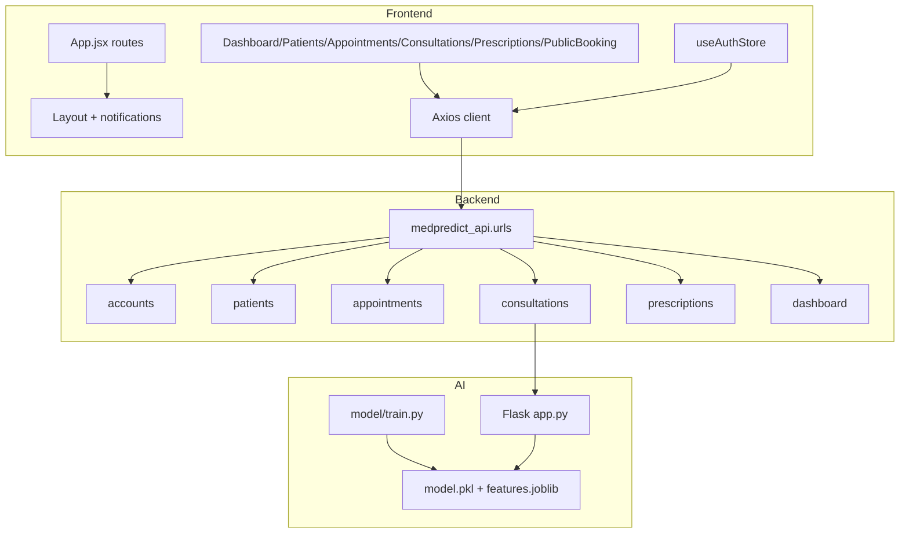
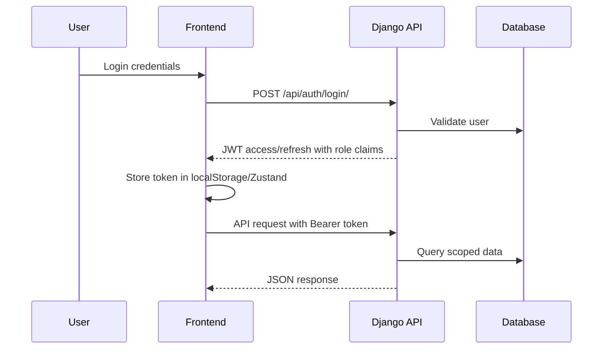
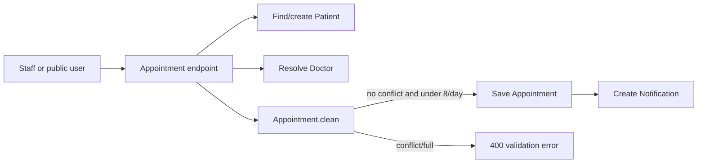
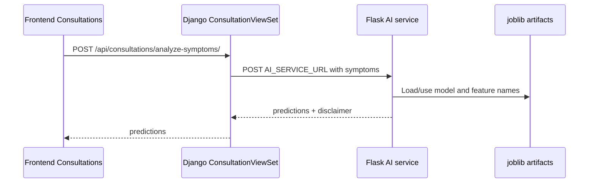
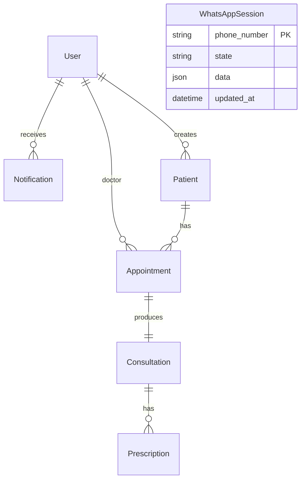

# MedPredict Architecture

## Module Map



## Backend Services

### Accounts

Responsibilities:

- Defines custom `User` model with `role` and `phone`.
- Defines `Notification`.
- Provides user and notification CRUD viewsets.
- Adds role/email/name custom claims to JWT tokens.
- Restricts user create/delete to authenticated admins.

### Patients

Responsibilities:

- Defines patient demographic and medical record fields.
- Validates Moroccan phone formats.
- Tracks creator via `created_by`.
- Exposes filtered/searchable patient CRUD.
- Scopes doctor access to patients with appointments for the doctor or patients created by that doctor.

### Appointments

Responsibilities:

- Defines appointment status lifecycle.
- Validates exact time-slot conflicts and daily capacity.
- Exposes authenticated appointment CRUD with doctor scoping.
- Creates doctor notifications when others schedule appointments.
- Exposes public doctors, available slots, and booking endpoints.
- Handles Twilio WhatsApp state machine.

### Consultations

Responsibilities:

- Links each consultation one-to-one with an appointment.
- Stores symptoms, examination, diagnosis, notes, and AI suggestions.
- Exposes CRUD with doctor scoping.
- Prevents secretaries from mutating consultations.
- Proxies symptom analysis to the AI service.

### Prescriptions

Responsibilities:

- Links prescriptions to consultations.
- Stores medication, dosage, posology, duration, and recommendations.
- Exposes CRUD with doctor scoping.
- Generates prescription PDF exports using ReportLab.

### Dashboard

Responsibilities:

- Aggregates total patients, doctors, recent consultations, pathology distribution, appointment status counts, and AI usage rate.

## Data Flow

### Authenticated API Flow



### Appointment Booking Flow



### AI Flow



Fail-safe behavior: if the Flask request raises a `requests` exception or returns a bad status, Django returns 503 with `{predictions: [], error: "AI Service unavailable"}`.

## Database Flow

Primary domain relationships:



Key tables/models:

- `accounts.User`: Django auth user plus `role` and `phone`.
- `accounts.Notification`: per-user notification feed.
- `patients.Patient`: patient identity, contact details, medical metadata, archive flag, creator.
- `appointments.Appointment`: patient, doctor, date, time, duration, reason, status.
- `appointments.WhatsAppSession`: Twilio conversation state.
- `consultations.Consultation`: appointment-linked clinical record and AI suggestions.
- `prescriptions.Prescription`: consultation-linked medication plan.

## API Flow

Root Django routes:

- `/api/auth/`
- `/api/patients/`
- `/api/appointments/`
- `/api/consultations/`
- `/api/prescriptions/`
- `/api/dashboard/`
- `/swagger/`
- `/redoc/`

Important custom endpoints:

- `POST /api/auth/login/`
- `POST /api/auth/token/refresh/`
- `PATCH /api/auth/notifications/mark_all_read/`
- `POST /api/appointments/public/book/`
- `GET /api/appointments/public/doctors/`
- `GET /api/appointments/public/available-slots/`
- `POST /api/appointments/whatsapp/webhook/`
- `POST /api/consultations/analyze-symptoms/`
- `GET /api/prescriptions/{id}/export-pdf/`
- `GET /api/dashboard/stats/`

## Frontend Flow

```mermaid
flowchart TD
    main[main.jsx] --> App[App.jsx]
    App --> Toast[ToastProvider]
    App --> Login[/login]
    App --> Book[/book public]
    App --> Guard[ProtectedRoute]
    Guard --> Layout[Layout with Sidebar/Topbar]
    Layout --> Dashboard[/]
    Layout --> Patients[/patients]
    Layout --> Appointments[/appointments]
    Layout --> Consultations[/consultations doctor/admin]
    Layout --> Prescriptions[/prescriptions doctor/secretary/admin]
```

The authenticated Axios client:

- Uses `VITE_API_BASE_URL` or `http://localhost:8000/api`.
- Adds `Authorization` header from `localStorage.medpredict_token`.
- Clears token/user keys and redirects to `/login` on HTTP 401.

## Worker Flow

There is no active worker process in the current repository.

Notable related settings:

- `CELERY_BROKER_URL = 'redis://redis:6379/0'` exists.
- No `celery.py`, tasks modules, Redis service, or worker command are present.

Treat Celery as a future/unused configuration unless new code introduces it.
