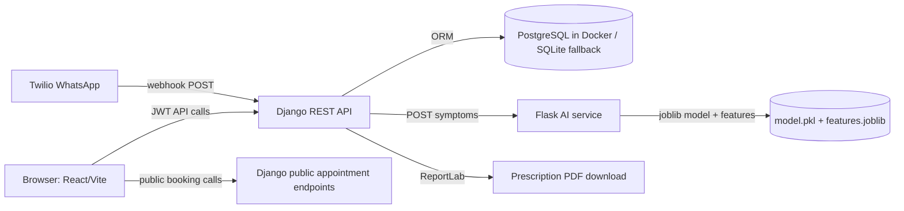

# MedPredict Project Overview

## Project Purpose

MedPredict is a full-stack medical practice management application for a clinic or doctor office. It manages staff authentication, patients, appointments, consultations, prescriptions, dashboard analytics, public appointment booking, a Twilio WhatsApp booking flow, and an AI-assisted symptom analysis service.

The application is organized as three application services plus a database:

- React/Vite frontend for the clinic UI and public booking flow.
- Django REST Framework backend for core business APIs, authentication, permissions, reporting, and PDF generation.
- Flask/scikit-learn AI service for symptom-to-disease prediction.
- PostgreSQL database in Docker Compose, with SQLite fallback for local backend runs outside Docker.

## Architecture Diagram



## Main Workflows

### Authenticated Clinic Workflow

1. User logs in at `/login`.
2. Frontend posts credentials to `POST /api/auth/login/`.
3. Backend returns SimpleJWT access and refresh tokens; custom claims include role, email, first name, and last name.
4. Frontend stores the access token in `localStorage` and Zustand persistent state.
5. Authenticated pages call protected API endpoints with `Authorization: Bearer <token>`.
6. Backend scopes data by role, especially for doctors.

### Patient And Appointment Workflow

1. Staff creates or edits patients at `/patients`.
2. Staff schedules appointments at `/appointments`.
3. `Appointment.clean()` prevents exact doctor/date/time double booking and caps non-cancelled appointments at 8 per doctor per day.
4. If an appointment is created for a doctor other than the current user, a `Notification` is created for that doctor.

### Consultation And AI Workflow

1. Doctors and admins use `/consultations`.
2. Frontend sends symptom arrays to `POST /api/consultations/analyze-symptoms/`.
3. Backend proxies symptoms to `AI_SERVICE_URL`.
4. Flask AI service loads `ai_service/model/model.pkl` and `ai_service/model/features.joblib`, builds a binary feature vector, and returns top predictions.
5. Backend returns AI data to the frontend; if the AI service fails, the backend returns a fail-safe 503 response with empty predictions.
6. Consultation records can persist symptoms, diagnosis, notes, and AI suggestions.

### Prescription Workflow

1. Users with frontend access to `/prescriptions` manage prescription records linked to consultations.
2. Backend scopes doctor reads to prescriptions for that doctor's consultations.
3. `GET /api/prescriptions/{id}/export-pdf/` generates a branded ReportLab PDF response.

### Public Booking Workflow

1. Public users visit `/book`.
2. Frontend calls unauthenticated endpoints:
   - `GET /api/appointments/public/doctors/`
   - `GET /api/appointments/public/available-slots/?doctor_id=&date=`
   - `POST /api/appointments/public/book/`
3. Backend finds or creates a patient by CIN, validates doctor/date/time, creates an appointment, and notifies the doctor.

### WhatsApp Booking Workflow

1. Twilio posts messages to `POST /api/appointments/whatsapp/webhook/`.
2. Backend stores conversation state in `WhatsAppSession`.
3. The flow collects CIN, patient name if new, doctor choice, date, and time.
4. The webhook creates an `Appointment` using hardcoded doctor usernames `dr_bennani` or `dr_chaoui`.

## Folder Explanations

- `backend/`: Django project and apps.
- `backend/medpredict_api/`: Django settings, root URL routing, WSGI/ASGI entrypoints.
- `backend/accounts/`: custom user model, roles, JWT custom claims, notifications.
- `backend/patients/`: patient model and CRUD API.
- `backend/appointments/`: appointment model/API, public booking endpoints, WhatsApp webhook/session model.
- `backend/consultations/`: consultation model/API and AI proxy endpoint.
- `backend/prescriptions/`: prescription model/API and PDF export.
- `backend/dashboard/`: aggregate statistics endpoint.
- `ai_service/`: Flask AI prediction API and training script.
- `ai_service/model/`: dataset, trained model artifact, and feature list artifact.
- `frontend/`: React/Vite app.
- `frontend/src/pages/`: page-level clinic and public booking screens.
- `frontend/src/components/`: layout, route guard, spinner, toasts.
- `frontend/src/services/`: Axios API client and interceptors.
- `frontend/src/store/`: Zustand auth and toast stores.
- `docs/knowledge/`: persistent codebase knowledge for future agents.

## Important Dependencies

Backend:

- Django and Django REST Framework for API and ORM.
- `djangorestframework-simplejwt` for JWT authentication.
- `django-filter` for API filtering.
- `corsheaders` for frontend access.
- `drf-yasg` for Swagger/ReDoc.
- `reportlab` for prescription PDF generation.
- `requests` for calling the AI microservice.
- `twilio` for WhatsApp webhook responses.

Frontend:

- React 19, React Router 7, Vite.
- Zustand for persisted auth and toast state.
- Axios for API calls.
- Chart.js and `react-chartjs-2` for dashboard charts.
- Lucide React for icons.
- FullCalendar dependencies exist but the current appointment page uses a custom table/form UI.
- Tailwind is configured and imported, with substantial custom CSS in `index.css`.

AI service:

- Flask and Flask-CORS.
- scikit-learn RandomForestClassifier.
- pandas, numpy, joblib.

## Deployment Flow

Docker Compose starts:

1. `db`: PostgreSQL 15 Alpine with `postgres_data` volume and `init_db.sql` mounted into Docker entrypoint.
2. `backend`: Django dev server at port 8000, bound to Postgres and `AI_SERVICE_URL=http://ai_service:5000/predict`.
3. `frontend`: Vite dev server at port 5173 in Compose, with `VITE_API_BASE_URL=http://localhost:8000/api`.
4. `ai_service`: Flask dev server at port 5000.

Startup scripts:

- `Makefile` provides the primary local command surface. `make setup` builds images, starts services, waits for Postgres, runs migrations, creates the default admin, seeds demo data, trains the AI model, and prints service URLs.
- `start.ps1` builds containers, runs migrations, creates an `admin` superuser, trains the AI model, and prints URLs.
- `start_ngrok.bat` actually runs `cloudflared.exe tunnel --url http://localhost:8000` for exposing the backend to Twilio.

Manual setup from `README.md`:

1. `docker-compose up --build -d`
2. Run Django migrations.
3. Create a superuser.
4. Run `docker-compose exec ai_service python model/train.py`.

Preferred local bootstrap after the Makefile was added:

```bash
make setup
```

## System Design Notes

- Backend default permissions require authentication globally, but public booking and WhatsApp endpoints explicitly allow unauthenticated access or bypass DRF permissions.
- Doctor scoping is implemented in `get_queryset()` methods rather than database row-level security.
- Secret key, debug mode, permissive CORS, and wildcard allowed hosts are development settings and not production-safe.
- `CELERY_BROKER_URL` exists in settings, but no Celery worker or Redis service is defined in Compose.
- `init_db.sql` is UTF-16 little-endian and appears to be a full dump with destructive `DROP` statements before `CREATE` statements.
- `frontend/vite.config.js` uses port 9654, but Docker Compose overrides the frontend command to run on port 5173.
